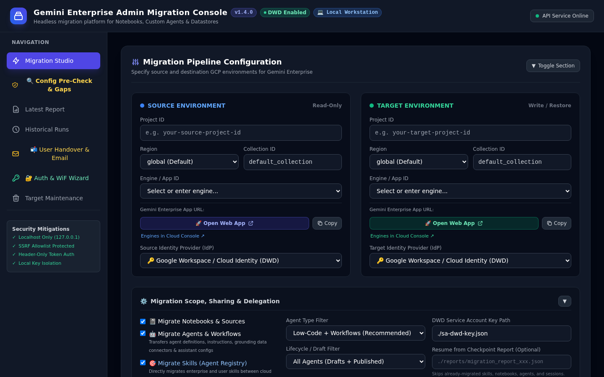
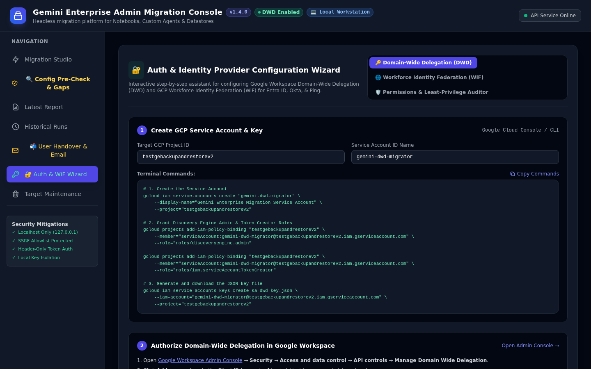

# 🚀 Gemini Enterprise Admin Migration Platform
## Installation, Environment Setup & Pre-Requisites Technical Guide

**Document Version:** `v1.5.5 (Enterprise Release)`  
**Target Platform:** Google Cloud Discovery Engine & Gemini Enterprise  
**Execution Profile:** Headless CLI & Local Workstation Web Console (`http://127.0.0.1:8080`)  
**Authentication Protocols:** Google Workspace Domain-Wide Delegation (OAuth2) & Microsoft Entra ID Workforce Identity Federation (STS)  
**Primary DOCX Document:** [INSTALLATION_GUIDE.docx](file:///usr/local/google/home/wdufrin/Documents/Code/headless%20migration%20tool/docs/INSTALLATION_GUIDE.docx)

---

## 1. Overview & Security Architecture

The **Gemini Enterprise Admin Migration Platform** (`gemini-migrate`) is a purpose-built, high-throughput enterprise migration solution designed to transfer Gemini Enterprise and Google Cloud Discovery Engine assets across Google Cloud projects, geographic regions, and Identity Providers on behalf of enterprise end users.

The platform migrates:
* **Research Notebooks & Granular Grounding Sources** (PDFs, Web URLs, YouTube videos, Google Drive docs)
* **Custom Agents** (Low-Code and Workflow agents with tool bindings and author tags)
* **User-Created Skills in Google Agent Registry** (`agentregistry.googleapis.com`)
* **Multi-Turn Chat Conversation History** (Turn-by-turn rehydration)
* **User Personalized Memories & Facts**
* **Studio Artifacts** (PowerPoint `.pptx` decks, Word `.docx` study guides, `.mp4` videos, offline HTML5 Quizzes and 3D Flashcards)

> [!IMPORTANT]
> **Workstation-Local Security Isolation Model**: To satisfy strict enterprise security and InfoSec audit requirements, the migration tool operates entirely within the administrator workstation boundary. No user data, prompt history, or private keys are transmitted to any third-party SaaS servers. All network calls are strictly restricted to official Google Cloud APIs.

### Security Guarantees:
* **Localhost-Only Network Binding**: The Web Console binds exclusively to `127.0.0.1` (`localhost`), eliminating exposure to external network interfaces.
* **SSRF Allowlist Protection**: Outbound requests from the proxy layer are cryptographically constrained to official Google API hostnames (`discoveryengine.googleapis.com`, `agentregistry.googleapis.com`, `gmail.googleapis.com`, `sts.googleapis.com`, `secretmanager.googleapis.com`).
* **Private Key Isolation**: Service Account private keys (`sa-dwd-key.json`) and RSA keys (`wif-migration-key.pem`) remain securely on local disk and are never sent over the wire.
* **Header-Only Token Injection**: Authentication credentials are transmitted strictly within HTTP `Authorization: Bearer` headers, preventing URL logging in intermediate proxies.


*Figure 1.1: Local Administration Console running on Workstation (`http://127.0.0.1:8080`)*

---

## 2. System & Workstation Prerequisites

Before deploying the migration tool, verify that the administrator workstation satisfies the minimum software dependencies:

| Component | Minimum Version | Recommended Version | Purpose / Description |
| :--- | :--- | :--- | :--- |
| **Node.js** | `v20.0.0 (LTS)` | `v22.x` or `v20.18+ (LTS)` | Asynchronous runtime executing CLI pipeline and local Express server |
| **npm** | `v10.0.0` | `v10.8+` | Package manager for installing dependencies |
| **Google Cloud SDK** | `v480.0.0` | Latest (`gcloud components update`) | CLI used for GCP authentication, IAM role binding, and ADC |
| **Operating System** | Linux / macOS / Windows WSL2 | Ubuntu 22.04 LTS / Debian 12 / macOS Sonoma | Host platform supported across Linux, macOS, and WSL2 |
| **ffmpeg (Optional)** | `v4.4+` | `v6.0+` (`apt install ffmpeg`) | Enables automated compression of high-bitrate Explainer Videos (> 12 MB) |

### Verifying Local Software Installation:
```bash
node --version     # Expected: v20.0.0 or higher
npm --version      # Expected: v10.0.0 or higher
gcloud --version   # Expected: Google Cloud SDK 480.0.0 or higher
ffmpeg -version    # Optional: Verifies video compression availability
```

---

## 3. Google Cloud Project Pre-Requisites & API Enablement

The migration platform interacts with Google Cloud Discovery Engine, Identity and Access Management, Google Agent Registry, and Gmail APIs. You must enable the following APIs in both the **Source GCP Project** and the **Target GCP Project** prior to migration.

| API Service Name | Endpoint Identifier | Required On | Functional Purpose |
| :--- | :--- | :--- | :--- |
| **Discovery Engine API** | `discoveryengine.googleapis.com` | Source & Target | Read/write access to engines, collections, notebooks, custom agents, and sessions |
| **Agent Registry API** | `agentregistry.googleapis.com` | Source & Target | Discovers and migrates enterprise skills created by end users |
| **Service Usage API** | `serviceusage.googleapis.com` | Source & Target | Verifies consumer project quotas and passes infrastructure pre-flight checks |
| **IAM Service Account API** | `iam.googleapis.com` | Target Project | Required for Service Account token minting and DWD impersonation |
| **Security Token Service** | `sts.googleapis.com` | Source & Target | Required for Workforce Identity Federation (WiF) OIDC token exchanges |
| **Gmail API (Optional)** | `gmail.googleapis.com` | Target Project | Required for dispatching user handover notification emails with attached study guides |
| **Secret Manager API** | `secretmanager.googleapis.com` | Target Project | Optional for secure enterprise storage of Service Account keys |

### Step 0: Administrator Authentication & Project Selection
Before enabling APIs, authenticate with Google Cloud using an account with project administration privileges:
```bash
# Authenticate gcloud CLI and Application Default Credentials (ADC)
gcloud auth login
gcloud auth application-default login

# Configure active GCP project
gcloud config set project <TARGET_PROJECT_ID>
```

### Enable Required Google Cloud APIs:
```bash
# Enable APIs on Source Project
gcloud services enable discoveryengine.googleapis.com \
                       agentregistry.googleapis.com \
                       serviceusage.googleapis.com \
                       sts.googleapis.com \
                       --project=<SOURCE_PROJECT_ID>

# Enable APIs on Target Project
gcloud services enable discoveryengine.googleapis.com \
                       agentregistry.googleapis.com \
                       serviceusage.googleapis.com \
                       iam.googleapis.com \
                       sts.googleapis.com \
                       gmail.googleapis.com \
                       secretmanager.googleapis.com \
                       --project=<TARGET_PROJECT_ID>
```

---

## 4. IAM Roles & Security Permissions Matrix

The migration administrator or execution identity requires distinct read and write privileges across the source and target environments:

| Environment | Role Name / Identifier | Role Type | Justification / Purpose |
| :--- | :--- | :--- | :--- |
| **Source Project** | `roles/discoveryengine.admin` *(or `viewer`)* | Predefined Role | Read-only discovery of engines, schemas, custom agents, notebooks, datastores, and chat turns |
| **Source Project** | `roles/serviceusage.serviceUsageConsumer` | Predefined Role | Authorizes Discovery Engine API consumption checks on source project |
| **Source Project** | `roles/iam.securityReviewer` | Predefined Role | Allows enumerating project IAM bindings (`resourcemanager.projects.getIamPolicy`) during User Discovery |
| **Target Project** | `roles/discoveryengine.admin` | Predefined Role | Creation and configuration of target engines, datastores, agents, and notebooks |
| **Target Project** | `roles/iam.serviceAccountTokenCreator` | Predefined Role | Allows minting user-scoped impersonation tokens via Domain-Wide Delegation or WiF |
| **Target Project** | `roles/serviceusage.serviceUsageConsumer` | Predefined Role | Authorizes Discovery Engine API consumption checks on target project |

> [!TIP]
> **Cross-Project IAM Architecture Rule & Resolution of 403 Errors**: Granting `roles/discoveryengine.admin` (or `viewer`), `roles/serviceusage.serviceUsageConsumer`, and `roles/iam.securityReviewer` on **both Source and Target projects** is mandatory. While Google Workspace Domain-Wide Delegation authorizes user token minting at the Workspace domain level, administrative pipeline operations (discovering engines, listing data stores, auditing schemas, and pre-flight parity checks) execute as the Service Account itself against both GCP projects.

---

## 4.1 Google Cloud Organization Policies & Security Constraints

Enterprise Google Cloud landing zones frequently enforce organizational constraints at the Organization or Folder hierarchy level. Before provisioning credentials, evaluate the following policies:

| Organization Policy Constraint | Target Requirement | Impact on Migration Tool | Remediation / Alternative |
| :--- | :--- | :--- | :--- |
| **`constraints/iam.disableServiceAccountKeyCreation`** | Key creation permitted on target project | **Blocks Pattern A Step 3**: Prevents generating `sa-dwd-key.json` | Use 1-Click project override in Auth Wizard, or adopt **Pattern B (WiF)** which is keyless and exempt. |
| **`constraints/iam.disableCrossProjectServiceAccountUsage`** | Target SA created within target project | **Blocks Cross-Project DWD**: A service account from the source project cannot access target Discovery Engine | Create and bind `gemini-dwd-migrator` directly within the Target GCP Project. |
| **`constraints/iam.allowedPolicyMemberDomains`** | Workforce & user domains allowed in IAM | **Restricts Cross-Domain Sharing**: Agent and Skill IAM sync (`setAgentIamPolicy`) fails if users belong to unauthorized external domains | Map source identities to target domain via `identityMapping`, or verify workforce pool `principalSet` is permitted. |
| **`constraints/discoveryengine.managed.allowedDataSources`** | Connectors permitted | Restricts data store attachment | Ensure required data sources (e.g. `custom_mcp`, Drive, GCS) are permitted by policy. |
| **`constraints/storage.uniformBucketLevelAccess`** | Uniform bucket-level access | Enforces bucket IAM over object ACLs | The migration tool defaults to standard IAM bucket permissions; avoid object-level ACLs. |

### Live Organization Policy Inspection & 1-Click Remediation:
The web console provides built-in pre-flight inspection in the **Auth & WiF Wizard** (`http://127.0.0.1:8080`):
1. Navigate to **Auth & WiF Wizard** &rarr; **Domain-Wide Delegation (DWD)**.
2. Enter your **Source GCP Project ID** and **Target GCP Project ID** and click **`🛡️ Check Org Policies`**.
3. If `iam.disableServiceAccountKeyCreation` is active, click **`⚡ 1-Click Project Override`** to apply a project-scoped exemption without altering the parent organization.

---

## 5. Authentication Setup & Credential Provisioning

The migration tool supports three flexible enterprise authentication patterns:

### Pattern A: Google Workspace / Cloud Identity via Domain-Wide Delegation (DWD)
Domain-Wide Delegation (DWD) enables the migration tool to restore chat history and personal research notebooks directly into each user's personal Google Workspace library.

1. **Create the migration service account in the Target GCP Project:**
   ```bash
   gcloud iam service-accounts create gemini-dwd-migrator \
       --display-name="Gemini Enterprise Migration Service Account" \
       --project=<TARGET_PROJECT_ID>
   ```

2. **Assign required IAM roles to the service account across BOTH Target and Source Projects:**
   ```bash
   # Grant roles on TARGET Project (Restore & Token Minting)
   gcloud projects add-iam-policy-binding <TARGET_PROJECT_ID> \
       --member="serviceAccount:gemini-dwd-migrator@<TARGET_PROJECT_ID>.iam.gserviceaccount.com" \
       --role="roles/discoveryengine.admin"

   gcloud projects add-iam-policy-binding <TARGET_PROJECT_ID> \
       --member="serviceAccount:gemini-dwd-migrator@<TARGET_PROJECT_ID>.iam.gserviceaccount.com" \
       --role="roles/iam.serviceAccountTokenCreator"

   gcloud projects add-iam-policy-binding <TARGET_PROJECT_ID> \
       --member="serviceAccount:gemini-dwd-migrator@<TARGET_PROJECT_ID>.iam.gserviceaccount.com" \
       --role="roles/serviceusage.serviceUsageConsumer"

   # Grant roles on SOURCE Project (MANDATORY for Cross-Project Discovery & Parity Audit)
   gcloud projects add-iam-policy-binding <SOURCE_PROJECT_ID> \
       --member="serviceAccount:gemini-dwd-migrator@<TARGET_PROJECT_ID>.iam.gserviceaccount.com" \
       --role="roles/discoveryengine.admin"

   gcloud projects add-iam-policy-binding <SOURCE_PROJECT_ID> \
       --member="serviceAccount:gemini-dwd-migrator@<TARGET_PROJECT_ID>.iam.gserviceaccount.com" \
       --role="roles/serviceusage.serviceUsageConsumer"

   gcloud projects add-iam-policy-binding <SOURCE_PROJECT_ID> \
       --member="serviceAccount:gemini-dwd-migrator@<TARGET_PROJECT_ID>.iam.gserviceaccount.com" \
       --role="roles/iam.securityReviewer"
   ```

3. **Export the service account JSON private key:**
   ```bash
   gcloud iam service-accounts keys create sa-dwd-key.json \
       --iam-account="gemini-dwd-migrator@<TARGET_PROJECT_ID>.iam.gserviceaccount.com"
   ```

   > [!IMPORTANT]
   > **Blocked by `iam.disableServiceAccountKeyCreation`?**  
   > If step 3 returns `FAILED_PRECONDITION: Key creation is disabled by organization policy`, choose one of two paths:
   > 1. **Project Override (Requires `roles/orgpolicy.policyAdmin`)**: In the web console Auth Wizard, click **`⚡ 1-Click Project Override`**, or run:
   >    ```bash
   >    cat <<EOF > /tmp/override_sa_key.yaml
   >    name: projects/<TARGET_PROJECT_ID>/policies/iam.disableServiceAccountKeyCreation
   >    spec:
   >      rules:
   >      - enforce: false
   >    EOF
   >    gcloud org-policies set-policy /tmp/override_sa_key.yaml --project=<TARGET_PROJECT_ID>
   >    ```
   > 2. **Adopt Keyless Pattern B (WiF)**: Switch to **Workforce Identity Federation**. WiF exchanges tokens with GCP STS dynamically and is **100% exempt from service account key policies**.

4. **Authorize the Client ID in Google Workspace Admin Console (`admin.google.com`):**
   * Sign in to **[admin.google.com](https://admin.google.com)** as a Super Administrator.
   * Navigate to **Security** &rarr; **Access and data control** &rarr; **API controls**.
   * Under **Domain-wide delegation**, click **Manage Domain Wide Delegation** &rarr; **Add new**.
   * Enter the **OAuth2 Client ID** of your service account (found in `sa-dwd-key.json` as `client_id`).
   * In the **OAuth Scopes** field, paste the exact comma-delimited scope string:
     ```text
     https://www.googleapis.com/auth/cloud-platform,https://www.googleapis.com/auth/discoveryengine,https://www.googleapis.com/auth/gmail.send,https://www.googleapis.com/auth/userinfo.email
     ```
   * Click **Authorize**.

---

### Pattern B: Microsoft Entra ID / Okta via Workforce Identity Federation (WiF)
For organizations authenticating via external Identity Providers (Microsoft Entra ID, Okta, Ping Identity), the platform uses Google Cloud Workforce Identity Federation and Security Token Service (STS).

1. Place your Workforce Identity Federation pool configuration in `workforce-identity-config.json`.
2. Provide RSA signing keys (`wif-migration-key.pem` and `wif-migration-jwks.json`) to sign user subject token assertions.
3. When migrating from Entra ID to Google Cloud Identity, the tool mints WiF STS tokens for source discovery and switches to DWD tokens for target restoration.


*Figure 1.2: Interactive Authentication & Workforce Identity Federation (WiF) Setup Wizard*

---

## 6. Installation, Local Build & Configuration

Follow these steps to clone, build, and configure the platform on your administrator workstation:

1. **Clone the repository:**
   ```bash
   git clone https://github.com/your-org/gemini-enterprise-admin-migration-tool.git
   cd gemini-enterprise-admin-migration-tool
   ```

2. **Install Node.js dependencies:**
   ```bash
   npm install
   ```

3. **Compile TypeScript to JavaScript production artifacts:**
   ```bash
   npm run build
   ```

4. **Configure `migration-config.json`:**
   Copy `config.example.json` to `migration-config.json` and customize your source and target environments:
   ```json
   {
     "source": {
       "projectId": "source-gcp-project",
       "appLocation": "global",
       "collectionId": "default_collection",
       "appId": "gemini-source-app",
       "assistantId": "default_assistant"
     },
     "target": {
       "projectId": "target-gcp-project",
       "appLocation": "global",
       "collectionId": "default_collection",
       "appId": "gemini-target-app",
       "assistantId": "default_assistant"
     },
     "options": {
       "dryRun": false,
       "migrateNotebooks": true,
       "migrateAgents": true,
       "migrateSessions": true,
       "migrateMemories": true,
       "exportArtifacts": true,
       "userFilter": ["*@company.com"]
     },
     "auth": {
       "authType": "SERVICE_ACCOUNT_KEY",
       "serviceAccountKeyPath": "./sa-dwd-key.json"
     }
   }
   ```

---

## 7. Launching & Validating the Console

You can run the migration platform either via the interactive Web Console or directly as a headless CLI script:

### Option 1: Launch Local Web Console
```bash
npm start
# Console listens on: http://127.0.0.1:8080
```
Open your web browser and navigate to `http://127.0.0.1:8080`. Verify that the status pill in the top-right reads **API Service Online**.

### Option 2: Headless CLI Execution
```bash
# Run full migration in dry-run simulation mode
npx tsx src/cli.ts --config migration-config.json --dry-run

# Run full live migration
npx tsx src/cli.ts --config migration-config.json
```

### Option 3: Run Automated Test Suite
```bash
npm test
# Executes 106 automated tests across 14 test suites covering auth, cross-project parity pre-checks, export, decommissioning, and rollback validation
```

### CLI Command-Line Flag Reference (`src/cli.ts`)

| Flag | Argument | Description | Default |
| :--- | :--- | :--- | :--- |
| `-c, --config` | `<path>` | Path to JSON migration configuration file | `migration-config.json` |
| `--dry-run` | — | Simulate migration without applying changes to target | `false` |
| `--no-notebooks` | — | Skip notebook and source migration | Enabled |
| `--no-agents` | — | Skip custom agent migration | Enabled |
| `--no-sessions` | — | Skip chat conversation history migration | Enabled |
| `--no-memories` | — | Skip personalized memories and facts migration | Enabled |
| `--no-skills` | — | Skip Agent Registry custom skills migration | Enabled |
| `--export-memories` | — | Export JSON snapshot of user memories to local disk | `false` |
| `--export-artifacts` | — | Export studio presentations, quizzes, and flashcards | `false` |
| `--agent-types` | `<types...>` | Filter agent migration by type (`LOW_CODE`, `WORKFLOW`, `ALL`) | `ALL` |
| `--publish-agents` | — | Auto-publish migrated agents to organizational gallery | `false` |
| `--no-preserve-sharing` | — | Do not replicate sharing configurations (`ALL_USERS`/`RESTRICTED`) | Replicate |
| `--users` | `<users...>` | Filter migration to specific user email(s) or patterns (e.g. `*@company.com`) | All |
| `--concurrency` | `<number>` | Maximum parallel worker concurrency | `10` |
| `--token` | `<token>` | Explicit Google OAuth Access Token (overrides ADC) | — |
| `--service-account-key` | `<path>` | Path to GCP Service Account JSON key for DWD | — |
| `--output-dir` | `<dir>` | Directory to output migration reports | `./reports` |
| `--resume` | `<reportPath>` | Resume migration by skipping already-successful assets from prior report | — |
| `--generate-user-reports` | — | Generate post-migration handover bundles and checklists per user | `false` |
| `--notify-users` | `[override]` | Dispatch bulk handover emails to users (or specify test override email) | — |
| `--no-zip-attachments` | — | Disable packaging user artifacts into `.zip` archive before emailing | ZIP enabled |
| `--no-optimize-media` | — | Disable automatic media optimization for slide decks and images | Optimized |

---

## 8. Troubleshooting & Common Installation Gotchas

| Symptom / Error Message | Root Cause | Actionable Resolution |
| :--- | :--- | :--- |
| **403 Forbidden: Caller does not have required permission to use project** | Service Usage API is disabled or caller lacks `roles/serviceusage.serviceUsageConsumer` | Run `gcloud services enable serviceusage.googleapis.com --project=<PROJECT_ID>` and grant `roles/serviceusage.serviceUsageConsumer` to caller. |
| **FAILED_PRECONDITION: Key creation is disabled by organization policy** | Organization policy `constraints/iam.disableServiceAccountKeyCreation` is active on target project | Click `⚡ 1-Click Project Override` in the Auth Wizard web console, apply `gcloud org-policies set-policy`, or switch to keyless **Pattern B (WiF)**. |
| **403 Forbidden on target resource (e.g. discoveryengine.sessions.create)** | Cross-project SA usage blocked by `constraints/iam.disableCrossProjectServiceAccountUsage` | Ensure the service account being used was created directly inside the Target GCP Project rather than referenced across projects. |
| **Request contains an invalid argument (Domain-restricted sharing)** | User email outside allowed customer IDs in `constraints/iam.allowedPolicyMemberDomains` | Use `identityMapping` in `migration-config.json` to map external identities to target enterprise domain accounts. |
| **invalid_grant: Invalid email or User ID** | DWD impersonation targeted a user email that does not exist in Google Workspace directory | Verify target user exists in Google Workspace Admin Console (`admin.google.com`) and DWD scopes are authorized. |
| **ENOENT: idp-subject-token.jwt does not exist** | WiF auth selected but subject token file has not been minted or has expired | Generate a fresh subject token using `wif-migration-key.pem` or switch auth type to ADC / DWD. |
| **EADDRINUSE: address already in use :::8080** | Another process is already bound to port 8080 on the workstation | Launch with custom port: `PORT=8085 npm start` or terminate the conflicting process (`lsof -i :8080`). |
| **Puppeteer / Chrome launch failed** | Missing Chrome executable on Linux workstation | Install Google Chrome: `apt-get install -y google-chrome-stable` or use pre-captured artifact assets. |

---

## 9. Application Decommissioning & Cleanup (Full Teardown)

When migration is complete or during environment reset, the tool provides **two distinct cleanup buttons** in Tab 6 (*Target Maintenance & Platform Decommission*):

### Button 1: Reset Target Project Assets (Test Iterations)
* **Purpose**: Reset migrated assets between test iterations without modifying credentials or IAM roles.
* **Scope**: Cleans migrated notebooks, custom agents, chat history, user memories, reports, and local artifacts.
* **Execution**: Click **Reset Target Project Assets (5 Categories)**. Requires typing target project ID to confirm.

### Button 2: Clean Up Install & Decommission Migration App (Full Teardown)
* **Purpose**: Completely uninstall the migration application and return both Google Cloud and your local workstation to their pre-setup baseline state.
* **Actions Executed**:
  1. **Reset Overwritten Org Policies**: Resets `iam.disableServiceAccountKeyCreation` back to inherit from the parent organization via `gcloud org-policies reset`.
  2. **Revoke GCP IAM Roles**: Strips `roles/discoveryengine.admin`, `roles/serviceusage.serviceUsageConsumer`, and `roles/iam.serviceAccountTokenCreator`.
  3. **Delete Service Account**: Deletes `gemini-dwd-migrator@<target-project>.iam.gserviceaccount.com` in Google Cloud IAM.
  4. **Invalidate Google Workspace DWD**: Permanently revokes token minting authority by deleting the Service Account in Google Cloud IAM. Note: Google Workspace has no public API to delete DWD entries automatically; a Super Admin must manually delete the client row at [admin.google.com/ac/owl/domainwidedelegation](https://admin.google.com/ac/owl/domainwidedelegation) (the tool provides the Client ID).
  5. **Delete Local Credentials & Configuration**: Removes `sa-dwd-key.json`, `workforce-identity-config.json`, `wif-migration-key.pem`, `wif-migration-jwks.json`, `idp-subject-token.jwt`, `migration-config.json`, and `.migration-state.json`.
  6. **Purge Output Folders**: Empties `./reports/`, `./exports/`, and `./user_handover_reports/`.
  7. **Optional Target Asset Wipe**: Checkbox to wipe all migrated Discovery Engine assets prior to credential removal.
* **Web Execution**: In Tab 6, type target project ID into the confirmation box and click **Clean Up Install & Decommission App**.
* **Headless CLI Execution**:
  ```bash
  npx tsx src/cli.ts decommission --project <TARGET_PROJECT_ID> --confirm <TARGET_PROJECT_ID> [--wipe-target-assets]
  ```

---

### Automated Rollback State Verification Engine
Following decommissioning (or at any audit interval), operators can run the verification engine to prove the environment is clean:
* **Cloud Checks**: Validates that `iam.disableServiceAccountKeyCreation` has no project-level override and inherits parent org policy, the migrator Service Account is permanently deleted from GCP IAM, zero IAM bindings remain on the target project, and Google Workspace DWD tokens are neutralized (with manual console deletion instructions provided).
* **Local Checks**: Validates that all private keys, JWT tokens, config files (`sa-dwd-key.json`, `workforce-identity-config.json`, etc.), and `.migration-state.json` are absent, and output directories (`reports/`, `exports/`, `user_handover_reports/`) are completely empty.
* **Web Execution**: Click **🔍 Verify Rollback State** in Tab 6 (Card 2).
* **Headless CLI Execution**:
  ```bash
  npx tsx src/cli.ts verify-rollback --project <TARGET_PROJECT_ID> [--service-account <SA_EMAIL>]
  ```
* **REST API**:
  ```bash
  curl -X GET "http://localhost:8080/api/maintenance/verify-rollback?targetProject=<TARGET_PROJECT_ID>"
  ```


