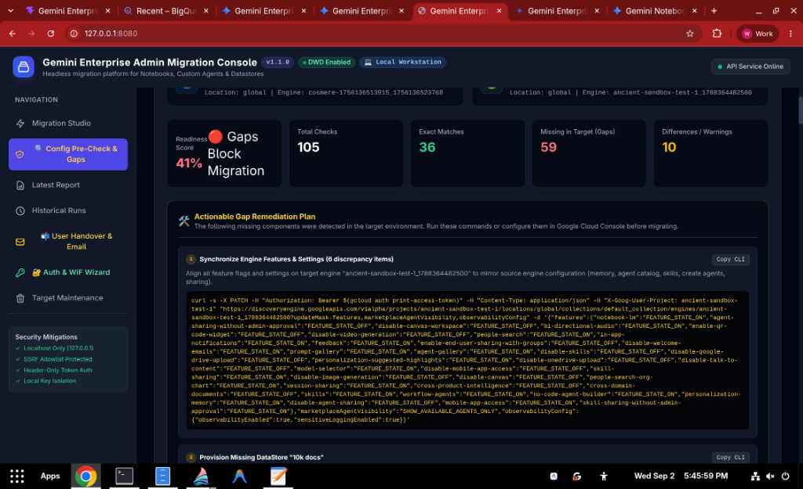
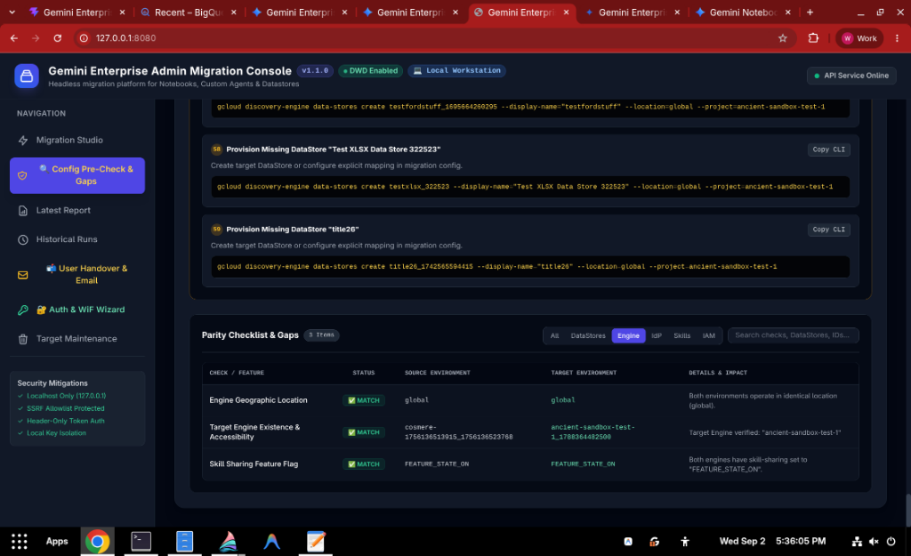
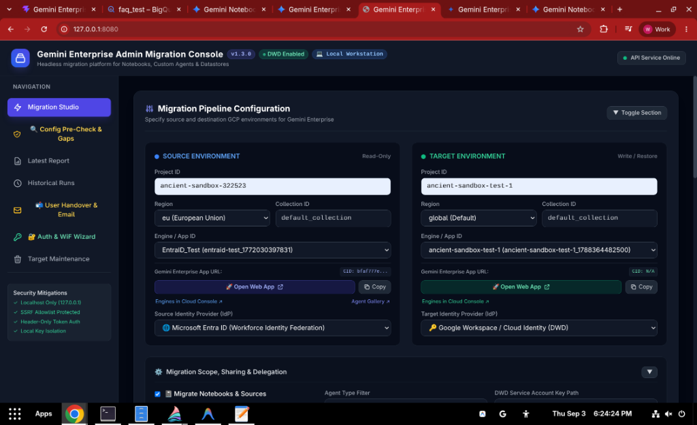
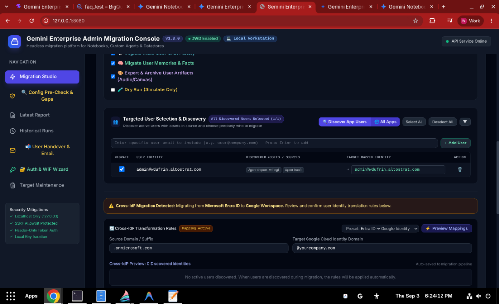
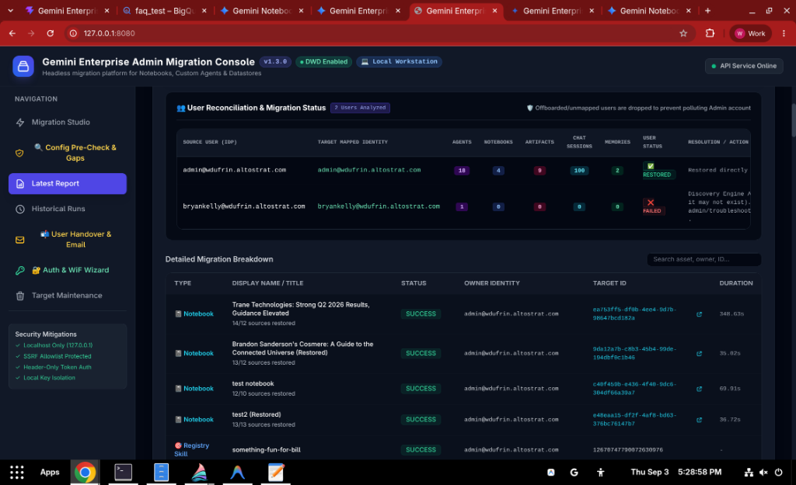
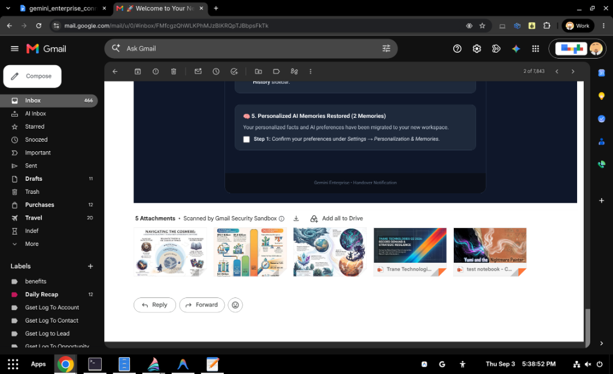
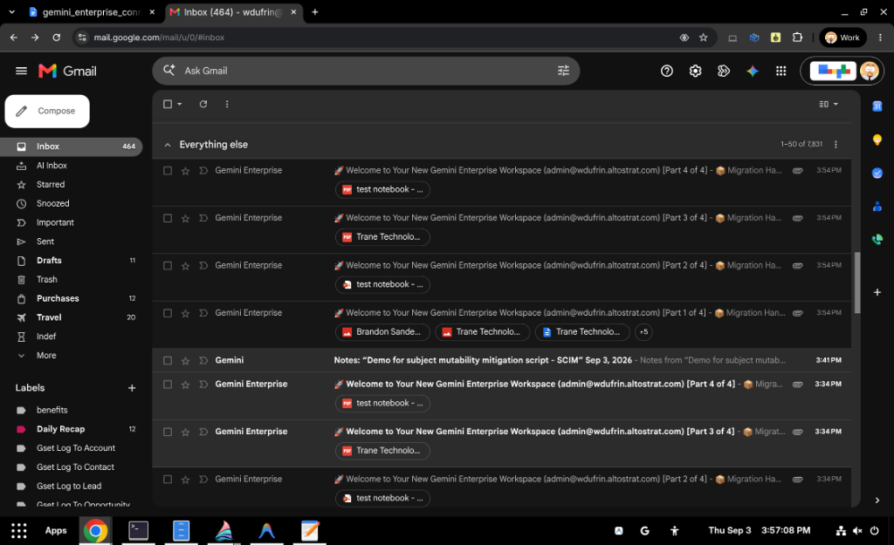
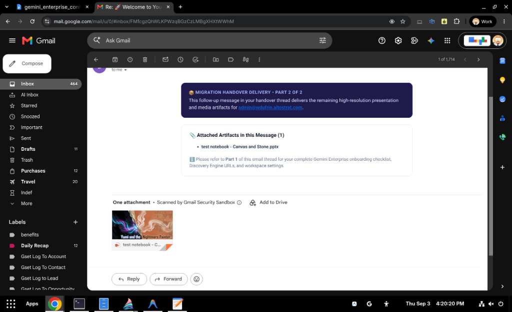
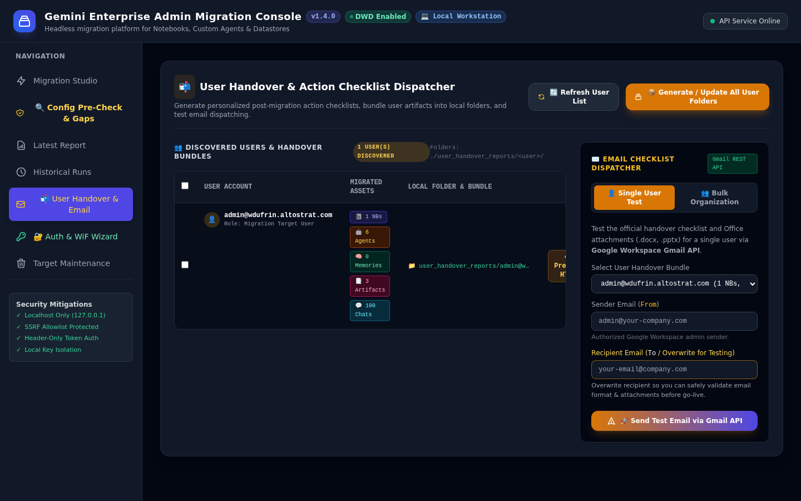
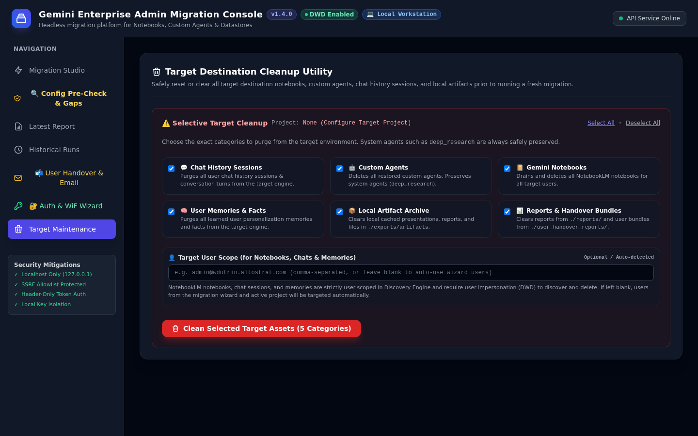

# 📘 Gemini Enterprise Admin Migration Platform
## Administrator & Operator User Guide

**Document Version:** `v1.5.5 (Enterprise Release)`  
**Target Audience:** Cloud Architects, Migration Operators & IT Administrators  
**Supported Assets:** Research Notebooks, Grounding Sources, Custom Agents, Chat Sessions, Personalized Memories & Studio Artifacts  
**Handover Formats:** Interactive Checklists, Single-ZIP Archives, Office PPTX/DOCX, Offline HTML5 Apps  
**Primary DOCX Document:** [USER_GUIDE.docx](file:///usr/local/google/home/wdufrin/Documents/Code/headless%20migration%20tool/docs/USER_GUIDE.docx)

---

## 1. Overview & Key Capabilities

The **Gemini Enterprise Admin Migration Platform** empowers Google Cloud administrators to execute frictionless, zero-data-loss migrations of Gemini Enterprise and Google Cloud Discovery Engine assets between Google Cloud projects, geographic regions, and Identity Providers.

* **Research Notebooks & Granular Grounding Sources**: Deep-clones notebooks and re-indexes all grounding sources (PDFs, URLs, YouTube videos, Google Drive docs, and text files) with individual integrity auditing.
* **Custom Agents & Tool Attachments**: Migrates Low-Code and Workflow agents, preserving system prompts, descriptions, author tags, and grounding DataStore connections as native editable drafts.
* **User-Created Skills in Agent Registry**: Migrates custom skills from `agentregistry.googleapis.com` while intelligently ignoring built-in 1P Google templates.
* **Multi-Turn Chat History**: Rehydrates conversational histories turn-by-turn into each user's left-hand Gemini Enterprise History sidebar.
* **Personalized AI Memories & Facts**: Discovers and exports user preferences, role profiles, and learned memory facts.
* **Studio Artifacts Export (PPTX, DOCX, Video, Interactive Apps)**: Converts generated presentations into native widescreen PowerPoint (`.pptx`) decks, briefing docs into formatted Microsoft Word (`.docx`) files, explainer videos with automated `ffmpeg` compression, and quizzes/flashcards into 100% offline interactive HTML5 applications.
* **Automated User Handover Delivery Engine**: Dispatches personalized email notifications with interactive onboarding checklists (`/checklist`) and a consolidated `NotebookLM_Artifacts.zip` archive.

---

## 2. Pre-Migration Parity Audit & Gap Remediation (Step 2)

Before executing a migration run, administrators execute a Configuration Pre-Check in **Step 2: Config & Parity Audit** (`#audit`) to verify that the target environment has all required feature toggles, security settings, and DataStores configured to support the migrated assets.

> [!WARNING]
> **Why Configuration Parity Matters**: Migrating custom agents or notebooks that reference missing DataStores or disabled platform features (such as user memories or skill sharing) can cause silent runtime errors for end users. The Parity Audit catches these gaps beforehand.

### Interactive Step 2 Environment Selector & Bi-Directional Sync
* **Direct Environment Configuration**: Step 2 features interactive Source and Target environment cards allowing administrators to directly configure Source Project ID, Region, Collection, and Engine/App ID as well as Target Project ID, Region, Collection, and Engine/App ID.
* **Real-Time Bi-Directional Synchronization**: Any configuration changed in Step 2 automatically synchronizes to Step 3 (Migration Studio), and vice-versa.
* **Guided Empty-State Guardrail**: Prevents premature API calls when project IDs are unconfigured, guiding the operator with actionable instructions.
* **Parity Readiness Score (0–100%)**: Click **Run Pre-Check** to analyze more than 100 configuration points across feature flags and attached DataStores.
* **Wizard Progression**: Click **`Next: Proceed to Step 3: Migration Studio ➔`** at the bottom of the audit report to carry configured environments directly into Migration Studio.


*Figure 2.1: Configuration Pre-Check & Gap Audit Screen with Parity Readiness Score*

### Actionable Gap Remediation Plan
For any detected discrepancies, the console offers a **1-Click Sync Target Engine Settings** button (`PATCH` API) and generates ready-to-run Google Cloud CLI commands. Administrators can copy these commands with a single click and execute them in Cloud Shell or a terminal.


*Figure 2.2: Actionable Gap Remediation Plan with 1-Click Copyable CLI Commands*

---

## 3. Migration Pipeline Configuration (Step 3: Migration Studio)

On the **Migration Studio** (`#studio`) tab, review or adjust the synchronized Source and Target environment parameters:

* **Source Project ID**: The GCP project hosting current Gemini Enterprise assets (e.g. `ancient-sandbox-322523`).
* **Source Region**: Geographic location (`global`, `eu`, `us-central1`).
* **Source Engine / App ID**: Dropdown auto-populated with discovered engines.
* **Source Identity Provider**: Select between `Google Workspace / Cloud Identity (DWD)` or `Microsoft Entra ID (Workforce Identity Federation)`.
* **Target Project ID & Region**: The destination environment (e.g. `testgebackupandrestorev3`).
* **Target Identity Provider**: Destination authentication provider.


*Figure 2.3: Migration Pipeline Configuration in Web Console*

---

## 4. Scoping & Asset Selection

Administrators can selectively include or exclude specific asset categories to tailor the migration scope:

| Scope Checkbox | Asset Category | Default State | Operational Effect |
| :--- | :--- | :--- | :--- |
| **Migrate Notebooks & Sources** | Research Notebooks & Grounding Docs | Enabled (Checked) | Restores notebooks and re-indexes all attached PDFs, URLs, and YouTube videos |
| **Migrate Custom Agents** | Low-Code & Workflow Agents | Enabled (Checked) | Deep-copies agent instructions, tools, and datastores as native editable drafts |
| **Migrate User Skills** | User-Created Skills in Agent Registry | Enabled (Checked) | Migrates custom skills in `agentregistry.googleapis.com` while ignoring built-in 1P Google templates |
| **Migrate Multi-User Chat History** | Chat Conversation History | Enabled (Checked) | Rehydrates chronological chat sessions into the target Gemini sidebar |
| **Migrate User Memories & Facts** | Personalized Facts & Profiles | Enabled (Checked) | Discovers and exports memory facts to local JSON backup and target library |
| **Export & Archive User Artifacts** | Studio Outputs & Presentations | Enabled (Checked) | Generates `.pptx` decks, `.docx` study guides, `.html` apps, and `.mp4` videos |
| **Dry Run (Simulate Only)** | Safety Simulation Mode | Disabled (Unchecked) | When checked, performs full discovery and logging without writing to target |

---

## 5. Targeted User Selection & Cross-IdP Transformation Rules

In enterprise migrations, you may want to migrate a pilot group of VIP users before rolling out to the entire organization. The platform provides granular user discovery and selection controls.

1. **Click Discover App Users**: The tool scans source DataStores and agents to discover all active user emails.
2. **Select Specific Users**: Check or uncheck individual users in the table.
3. **Configure Cross-IdP Domain Mapping**: When migrating between different IdPs (e.g. Microsoft Entra ID to Google Cloud Identity), configure the transformation rules.

> [!TIP]
> **Cross-IdP Domain Translation Rules**: When moving from Entra ID (`user@tenant.onmicrosoft.com`) to Google Cloud Identity (`user@company.com`), the tool automatically strips the source suffix and appends the target domain, completely preventing duplicate domain concatenation bugs.


*Figure 2.4: Targeted User Discovery and Cross-IdP Transformation Matrix*

---

## 6. Executing the Migration Pipeline

Once configured, click **🚀 Run Live Migration** (or **Simulate Dry Run**). The migration pipeline executes across 7 discrete stages:

1. **Stage 1: Pre-Flight Infrastructure Checks** — Verifies target engine existence, accessibility, and service usage quotas.
2. **Stage 2: Notebooks & Granular Sources Restoration** — Syncs research notebooks and restores individual grounding documents.
3. **Stage 3: User Skills Discovery & Restoration** — Migrates custom skills in `agentregistry.googleapis.com`.
4. **Stage 4: Custom Agents Restoration** — Creates target agents as editable drafts with preserved system instructions.
5. **Stage 5: Multi-Turn Chat Conversation Rehydration** — Recreates conversational turns chronologically for each user.
6. **Stage 6: Personalized AI Memories & Facts Export** — Backs up and migrates discovered user facts.
7. **Stage 7: Studio Artifacts Discovery, Office Generation & Compression** — Synthesizes PPTX presentations, Word study guides, interactive HTML5 quiz/flashcard apps, and compresses Explainer Videos.

---

## 7. Migration Reports & Reconciliation Auditing

Upon pipeline completion, the platform generates comprehensive executive and machine-readable audit reports saved in `reports/`:
* **Markdown Report** (`reports/migration-report-<ID>-<TIMESTAMP>.md`): Human-readable executive summary with detailed asset breakdown.
* **JSON Report** (`reports/migration-report-<ID>-<TIMESTAMP>.json`): Full telemetry schema for SIEM or enterprise database logging.
* **User Reconciliation Matrix**: Comprehensive table matching each source user identity with their target Google identity, listing restored vs. failed counts across all asset categories.


*Figure 2.9: Migration Report and User Reconciliation Matrix in Web Console*

---

## 8. User Handover Delivery & Notification Engine

To deliver a seamless day-one onboarding experience, the platform packages each user's assets into a single consolidated `NotebookLM_Artifacts.zip` archive and dispatches an onboarding email.

* **Action-Oriented Checklists**: The email features interactive checkboxes `[ ]` guiding users through initial sign-in, connector authorizations (Outlook, OneDrive, Google Drive, Jira), and agent publishing.
* **Smart Deduplication**: Static HTML document viewers are excluded when authentic Word documents are attached, but interactive quiz and flashcard apps are explicitly preserved alongside Word study guides.
* **Multi-Part Email Threading**: If user assets exceed Gmail's 14.5 MB unencoded per-message threshold, attachments are automatically bin-packed into sequential parts and delivered within a single threaded conversation (`In-Reply-To`).


*Figure 2.10: Migration Handover Notification Received in Gmail with Attachments*


*Figure 2.11: Multi-Part Handover Thread with Partitioned Attachments in Gmail*


*Figure 2.12: Handover Follow-Up Message with High-Resolution Deck*


*Figure 2.13: User Handover & Email Delivery Console Tab*

---

## 9. Auth & Identity Provider Configuration Wizard (Step 1: DWD & WiF)

The **Auth & WiF Wizard** (`#wizard`) provides an interactive, guided interface to configure and test authentication protocols across Google Workspace and external Identity Providers (Microsoft Entra ID, Okta, Ping).

### 9.1 Domain-Wide Delegation (DWD) & Cross-Project IAM Generator
When configuring Google Workspace Domain-Wide Delegation in Step 1:
* **Dual Project Topology Input**: Accepts both **Source GCP Project ID** and **Target GCP Project ID** (`wizDwdSrcProject` and `wizDwdProject`), automatically synchronizing with Step 2 and Step 3.
* **Cross-Project IAM Command Generator**: Generates copy-paste ready `gcloud` CLI commands granting `roles/discoveryengine.admin` and `roles/serviceusage.serviceUsageConsumer` across **both** Source and Target environments, along with an Architecture Explainer clarifying user impersonation vs administrative pipeline permissions.
* **`🛡️ Check Org Policies`**: Performs live inspection of target project organization policies (`iam.disableServiceAccountKeyCreation`, `iam.disableCrossProjectServiceAccountUsage`, and `iam.allowedPolicyMemberDomains`).
* **Conflict Detection**: If `iam.disableServiceAccountKeyCreation` is active, an alert banner warns the operator before executing CLI commands that creating `sa-dwd-key.json` will fail.
* **⚡ 1-Click Project Override**: Operators holding `roles/orgpolicy.policyAdmin` can click the 1-Click Project Override button to automatically apply a project-scoped exemption (`enforce: false`) without modifying parent organizational policies.
* **Live DWD Impersonation Test**: Validates that minted user-scoped OAuth2 tokens function against Discovery Engine APIs.

### 9.2 Workforce Identity Federation (WiF) — Keyless Enterprise Path & Architecture
For organizations authenticating end users via external Identity Providers (Microsoft Entra ID, Okta, Ping Identity) or operating under strict Zero-Trust keyless security baselines:

* **Keyless Architecture**: WiF exchanges short-lived ID tokens with Google Cloud Security Token Service (`sts.googleapis.com`) to mint ephemeral access tokens. It is **100% exempt from `iam.disableServiceAccountKeyCreation`** and service account key upload organization policies.
* **The Headless Migration Provider Pattern (`migration-dwd-provider`)**:
  * Standard enterprise Okta/Entra OIDC/SAML providers require interactive browser redirects and MFA popups, making unattended bulk migration impossible.
  * To enable automated, headless migration of user-owned assets without requiring interactive logins or harvesting user passwords, the platform introduces a **Headless Migration Provider** (`migration-dwd-provider`) registered directly inside the customer's existing Workforce Identity Pool (e.g., `locations/global/workforcePools/<POOL>/providers/migration-dwd-provider`).
  * The migration workstation generates a dedicated RSA private key (`wif-migration-key.pem`) and exports its public JSON Web Key Set (`wif-migration-jwks.json`).
  * By registering `migration-dwd-provider` with this JWKS endpoint or file in GCP IAM, the migration tool can sign local OIDC JWT assertions asserting a user's identity and exchange them at `sts.googleapis.com` for genuine GCP Workforce access tokens on behalf of any enterprise user.
* **Direct Workforce User Tokens vs. Service Account Impersonation**:
  * > [!IMPORTANT]
    > **Why Service Account Impersonation Cannot Migrate User Notebooks or Sessions**: In Gemini Enterprise / Discovery Engine, user-owned assets (NotebookLM research notebooks, personalized memories, and chat sessions) **cannot** be read, listed, or created by a Service Account (`gemini-dwd-migrator@...`). Swapping a user's Workforce STS token for a Service Account access token via `iamcredentials.googleapis.com` discards the user's human context and assumes the Service Account's identity (`serviceAccount:...`).
  * For all user-scoped data operations, the migration engine bypasses service account impersonation entirely and calls Discovery Engine APIs (`notebooks:listRecentlyViewed`, `sessions`, `memories`) **directly using the minted Workforce User STS token** (`principal://iam.googleapis.com/locations/global/workforcePools/<POOL>/subject/<USER>`).
  * Service Account impersonation remains available solely as an optional secondary mechanism for administrative, project-wide infrastructure tasks (such as inspecting data store schemas or enabling platform feature flags).
* **`google.subject` & `google.groups` Parity Architecture**:
  * In GCP IAM, access is granted either to individual workforce principals (`principal://iam.googleapis.com/locations/global/workforcePools/<POOL>/subject/<SUBJECT>`) or to IdP security groups (`principalSet://iam.googleapis.com/locations/global/workforcePools/<POOL>/group/<GROUP>`).
  * To ensure the minted workforce user token inherits the user's authentic permissions on the Gemini Enterprise project, `migration-dwd-provider` **must construct the exact same principal string as the customer's production IdP provider** (e.g., `oidc-okta` or `entra-id-provider`).
  * **Case-Sensitivity Alignment**: Production enterprise providers typically enforce canonical casing via CEL:
    ```cel
    google.subject = assertion.email.lowerAscii()
    ```
    If `migration-dwd-provider` maps `google.subject = assertion.sub` without `.lowerAscii()`, a user whose email contains uppercase characters (`User@Company.com`) will resolve to a different principal ID than their real IAM binding, immediately causing `HTTP 403: Permission 'discoveryengine.notebooks.list' denied`.
  * **Group Claim Preservation**: If `roles/discoveryengine.user` is granted to an IdP group (e.g. `principalSet://.../workforcePools/<POOL>/group/Gemini-Users`), `migration-dwd-provider` must map:
    ```cel
    google.groups = assertion.groups
    ```
  * **Semantic Cross-Protocol Equivalence**: The preflight validator recognizes that OIDC `assertion.email.lowerAscii()` and SAML `assertion.subject.lowerAscii()` (where SAML NameID is `emailAddress`) are semantically equivalent—both resolve to the canonical lowercase email address (`user@company.com`).
* **Automated GE App Workforce Discovery (`/api/wizard/wif-discovery`)**:
  * The wizard automatically queries the Gemini Enterprise Access Control configuration (`discoveryengine.googleapis.com/v1alpha/projects/<PROJECT>/locations/<LOC>/aclConfig`) to discover the production Workforce Identity Pool ID and identity provider type (`idpType: THIRD_PARTY`).
  * It scans the project's live IAM policy (`getIamPolicy`) to discover existing group bindings (`principalSet://.../workforcePools/<POOL>/group/...`) and sample user subjects.
  * It evaluates all providers in the pool and generates an **Aligned Migration Mapping Plan**:
    ```bash
    --attribute-mapping="google.subject=assertion.email.lowerAscii(),google.groups=assertion.groups,attribute.user_email=assertion.email"
    ```
* **Stateless Federation & Wildcard IAM Pool Bindings**:
  * Unlike Google Workspace DWD (which checks Google Admin Directory and rejects non-existent emails with `invalid_grant`), GCP Workforce Identity Federation is **stateless**: GCP STS validates the RSA signature against `wif-migration-jwks.json` without contacting Okta or Entra ID.
  * In test or sandbox projects where administrators grant permissions using a pool-wide wildcard (`principalSet://.../workforcePools/<POOL>/*`), **any** email string (even a typo or made-up email) will pass IAM and return `200 OK` with `{}` (**0 notebooks**).
  * In contrast, production enterprise environments grant permissions to specific users or IdP groups. Therefore, Step 4 inspects the returned notebook count: if `0 notebooks` are returned, it displays an amber warning (`⚠️ API Access Verified (200 OK) — 0 Notebooks Found for User`) reminding operators that they must test a user known to own $\ge 1$ notebook to confirm real data visibility.
* **3-Stage Live End-to-End User Verification (`/api/wizard/test-wif`)**:
  * Clicking **Test User STS Token, Subject Parity & Notebooks Access** runs a rigorous 3-stage validation:
    1. **Stage 1 (STS Token Minting)**: Mints a workforce token for `Target User Email to Test` against `sts.googleapis.com`.
    2. **Stage 2 (Subject & Group Parity Check)**: Compares `migration-dwd-provider` against the pool's authoritative production provider (`evaluateSubjectMapping`). If a subject expression mismatch is detected, the check fails with the exact `update-oidc` command needed to align it.
    3. **Stage 3 (Live User Notebooks API Probe)**: Calls `https://discoveryengine.googleapis.com/v1alpha/projects/<PROJECT>/locations/global/notebooks:listRecentlyViewed?pageSize=1` **directly with the user's Workforce STS token** (`discoveryengine.notebooks.list`). If the user lacks access, the test fails loudly with full remediation instructions rather than falsely reporting success.

### 9.3 Permissions & Least-Privilege Auditor
The Auditor evaluates target environments against Google SAIF and least-privilege standards:
* Evaluates Discovery Engine read/write scopes, NotebookLM source access, and Gmail API dispatch scopes.
* Flags over-provisioned permissions or destructive deletion privileges.
* Runs automated organization policy compliance audits on the target project.
* Offers 1-click IAM policy bindings auto-fixes for missing roles.

### 9.4 Troubleshooting Guide & Enterprise Error Remediations

| Error / Symptom | Root Cause | Step-by-Step Remediation |
| :--- | :--- | :--- |
| **`Permission 'discoveryengine.notebooks.list' denied on resource //discoveryengine.googleapis.com/projects/<PROJECT>/locations/global (HTTP 403)`** | (1) `migration-dwd-provider` mapped `google.subject=assertion.sub` while the GE App uses `assertion.email.lowerAscii()`; or (2) `roles/discoveryengine.user` is bound to an IdP group but `google.groups=assertion.groups` was missing from the provider; or (3) target user lacks `roles/discoveryengine.user` or `roles/serviceusage.serviceUsageConsumer`. | **1. Align Provider Mapping:** Run `gcloud iam workforce-pools providers update-oidc migration-dwd-provider --workforce-pool=<POOL> --location=global --attribute-mapping="google.subject=assertion.email.lowerAscii(),google.groups=assertion.groups,attribute.user_email=assertion.email"`.<br>**2. Grant User Roles on Project:** `gcloud projects add-iam-policy-binding <PROJECT> --role="roles/discoveryengine.user" --member="principal://iam.googleapis.com/locations/global/workforcePools/<POOL>/subject/<USER_EMAIL>"`.<br>**3. Grant Service Usage Consumer:** `gcloud projects add-iam-policy-binding <PROJECT> --role="roles/serviceusage.serviceUsageConsumer" --member="principal://iam.googleapis.com/locations/global/workforcePools/<POOL>/subject/<USER_EMAIL>"`. |
| **`WorkforceSubjectMappingMismatch: Subject mapping mismatch`** | The Workforce Pool contains multiple providers with differing subject CEL expressions (e.g. `oidc-okta` uses `assertion.email.lowerAscii()`, `okta-saml` uses `assertion.subject.lowerAscii()`). | Update `migration-dwd-provider` to match the canonical lowercase email format (`assertion.email.lowerAscii()`). The preflight validator automatically treats OIDC and SAML lowercase email mappings as semantically aligned. |
| **`The issuer in ID Token does not match...`** | The client configuration (`workforce-identity-config.json`) points to an interactive production provider (`oidc-okta` or `entra-id-provider`) instead of the headless `migration-dwd-provider`. | In Step 1 of the Wizard, select the **Migration DWD** preset or set `providerId` to `migration-dwd-provider` and `issuer` to `https://gemini-migration.internal`. Click **Generate & Save WiF Config**. |
| **`USER_PROJECT_DENIED / serviceusage`** | The workforce principal or service account has not been authorized as a Service Usage Consumer on the quota project. | Grant `roles/serviceusage.serviceUsageConsumer` to the workforce principal or pool: `gcloud projects add-iam-policy-binding <PROJECT> --role="roles/serviceusage.serviceUsageConsumer" --member="principalSet://iam.googleapis.com/locations/global/workforcePools/<POOL>/*"`. |
| **`invalid_grant: Invalid email or User ID`** | Domain-Wide Delegation (DWD) impersonation attempted to mint an OAuth2 token for an email address that does not exist in Google Workspace Admin Directory. | Verify that the target email exists in Google Workspace (`admin.google.com/ac/users`). If migrating from an external IdP (Entra/Okta) to Google Workspace, configure Cross-IdP transformation rules in Step 3 (`identityMapping`) to map source usernames to active Google Workspace accounts. |
| **`403 retry loop between WIF and DWD`** | A Discovery Engine request failed with HTTP 403 under WIF, and the migration engine attempted to retry using DWD credentials, but DWD was unconfigured or re-sent the same WIF token. | The platform now enforces strict mode isolation: when retrying under `preferredMode: 'DWD'`, it requires authentic Google Workspace DWD credentials (`sa-dwd-key.json`). If DWD credentials are not present, it fails immediately with clear diagnostic context rather than re-sending the failed WIF token. |

---

## 10. Target Maintenance & Selective Rollback

The **Target Maintenance** console provides two distinct operational flows depending on whether you are resetting assets between test iterations or performing a complete teardown of the migration app:

### Button 1: Reset Target Project Assets (Test Iterations)
Use this button during testing or staged rollouts to selectively purge migrated assets in the target environment prior to a fresh migration wave without disturbing authentication or GCP infrastructure:

| Maintenance Option | Scope of Action | Risk Level | Recommendation |
| :--- | :--- | :--- | :--- |
| **Clean Target Chats** | Deletes migrated chat sessions for selected users | Low | Safe to run between test iterations to avoid duplicate session history |
| **Clean Target Agents** | Removes custom agents created by migration pipeline | Medium | Use when iterating on system prompt translations or tool bindings |
| **Clean Target Notebooks** | Deletes migrated research notebooks in target | Medium | Use when re-testing source ingestion or PDF uploads |
| **Clean User Memories** | Purges personalized user facts & memory profiles | Low | Cleans personalization state across all target user scopes |
| **Clean Exported Artifacts** | Clears `exports/artifacts/` folder on local disk | Low | Frees local disk space without modifying cloud environments |
| **Clean Migration Reports** | Clears `reports/` folder on local disk | Low | Archives old run logs and handover bundles |

* **Execution**: Click **Reset Target Project Assets (5 Categories)**.
* **Safety Confirmation**: You must type the Target Project ID to confirm execution.

---

### Button 2: Clean Up Install & Decommission Migration App (Full Teardown)
When all migration waves are complete, or when decommissioning the migration workstation, use this button to perform a complete application uninstall and restore your Google Cloud project and workstation to their pre-setup baseline:

1. **🛡️ Reset Overwritten Organization Policies**: Automatically resets `iam.disableServiceAccountKeyCreation` (and any other tracked overrides) back to inherited defaults from parent organization using `gcloud org-policies reset`.
2. **👤 Delete Migration Service Account & Strip IAM Roles**: Revokes `roles/discoveryengine.admin`, `roles/serviceusage.serviceUsageConsumer`, and `roles/iam.serviceAccountTokenCreator`, then permanently deletes `gemini-dwd-migrator@<target-project>.iam.gserviceaccount.com`.
3. **🔑 Invalidate Google Workspace Domain-Wide Delegation (DWD)**: Deleting the service account from GCP IAM permanently neutralizes and invalidates its numeric OAuth2 Client ID (preventing token generation).
   > [!NOTE]
   > **Google Workspace API Boundary**: Google Workspace enforces an administrative security boundary and does not expose a public API to programmatically delete Domain-Wide Delegation authorizations. While the underlying GCP Service Account is permanently deleted in Google Cloud IAM (preventing any tokens from being minted), a Workspace Super Administrator must perform a 2-click deletion in the Google Admin Console ([admin.google.com/ac/owl/domainwidedelegation](https://admin.google.com/ac/owl/domainwidedelegation)) to prune the client entry. The tool provides the exact Client ID and direct console link.
4. **📄 Delete Local Credential & JSON Configuration Files**: Deletes `sa-dwd-key.json`, `workforce-identity-config.json`, `wif-migration-key.pem`, `wif-migration-jwks.json`, `idp-subject-token.jwt`, `migration-config.json`, and `.migration-state.json`.
5. **📦 Purge Local Reports & Artifact Exports**: Empties `./reports/`, `./exports/`, and `./user_handover_reports/`.
6. **🧹 Optional Target Asset Wipe**: Checking *"Also wipe migrated Discovery Engine assets in target project"* cleans all migrated notebooks, agents, chat sessions, and memories before removing credentials.
7. **✨ Pristine Baseline State**: Clears all local state caches so the workstation and cloud environment are returned to their pre-setup state.

* **Execution via Web Console**: In Tab 6, type the Target Project ID in the confirmation box and click **Clean Up Install & Decommission App**.
* **Execution via Headless CLI**:
  ```bash
  npx tsx src/cli.ts decommission --project <TARGET_PROJECT_ID> --confirm <TARGET_PROJECT_ID> [--wipe-target-assets]
  ```

---

### Automated Rollback State Verification Engine
To guarantee enterprise security and satisfy compliance audits, the tool includes a comprehensive verification engine that inspects both cloud and local dimensions to prove that all changes have been completely rolled back:

1. **🛡️ Organization Policy Override (`iam.disableServiceAccountKeyCreation`)**: Queries Google Cloud Resource Manager / Org Policies to verify that no project-level override exists (`enforce: false` removed) and policies inherit from the parent organization default.
2. **👤 Service Account Existence (`gemini-dwd-migrator`)**: Queries GCP IAM to confirm the service account returns `NOT_FOUND` / 404.
3. **🔐 Target Project IAM Policy Bindings**: Inspects target project IAM policies to prove zero role bindings remain attached to the migration service account.
4. **🔑 Google Workspace Domain-Wide Delegation (DWD)**: Validates that permanent deletion of the service account has permanently invalidated its OAuth2 numeric Client ID (preventing token generation) and provides instructions to prune the client row from the Workspace Admin Console.
5. **📄 Local Credential & Configuration Files**: Verifies that `sa-dwd-key.json`, `workforce-identity-config.json`, `wif-migration-key.pem`, `wif-migration-jwks.json`, `idp-subject-token.jwt`, and `migration-config.json` are absent from disk.
6. **📁 Local Output & Artifact Directories**: Scans `./reports/`, `./exports/`, and `./user_handover_reports/` to verify zero residual files remain.
7. **💾 Application State Cache & History**: Inspects `.migration-state.json` to ensure all tracked state is cleared.

* **Web Console Verification**: In Tab 6 (Card 2), click **🔍 Verify Rollback State** to run a live audit at any time, or let it trigger automatically upon decommissioning completion. An interactive status container displays green checkmarks for all clean resources or actionable warnings if residuals are detected.
* **Headless CLI Verification**:
  ```bash
  npx tsx src/cli.ts verify-rollback --project <TARGET_PROJECT_ID> [--service-account <SA_EMAIL>]
  ```
* **REST API Endpoints**: `GET /api/maintenance/verify-rollback?targetProject=<PROJECT_ID>` and `POST /api/maintenance/verify-rollback`.


*Figure 2.14: Target Maintenance & Platform Decommissioning Console*

---

## 11. Enterprise Migration Playbook & Best Practices

Follow this recommended four-phase migration playbook for enterprise rollouts:

### Phase 1: Pre-Flight Discovery & Parity Alignment
1. Open the **Auth & WiF Wizard** and run **`🛡️ Check Org Policies`** to verify that target project policies (`iam.disableServiceAccountKeyCreation`, `iam.disableCrossProjectServiceAccountUsage`) permit credential provisioning or apply 1-click project overrides.
2. Run Configuration Pre-Check & Gap Audit against Source and Target engines.
3. Execute generated CLI commands to align DataStores and feature flags.
4. Confirm that caller identity has `roles/serviceusage.serviceUsageConsumer` on both projects.

### Phase 2: Pilot Wave Execution (5–10 VIP Users)
1. Select 5–10 active power users with notebooks and agents.
2. Run a Dry Run simulation to verify identity mapping and asset discovery.
3. Execute Live Migration and review the resulting Markdown audit report.
4. Dispatch pilot handover emails and verify user receipt in Gmail.

### Phase 3: Production Bulk Migration Wave
1. Execute migration for remaining organizational users.
2. Monitor streaming event logs for any network throttling or quota pauses.
3. Verify that 100% of discovered notebooks, sources, and agents migrated successfully.

### Phase 4: Post-Migration Handover & Support
1. Dispatch bulk handover email packages with `NotebookLM_Artifacts.zip`.
2. Direct users to `/checklist` for guided day-one onboarding steps.
3. Archive final migration reports for compliance records.

